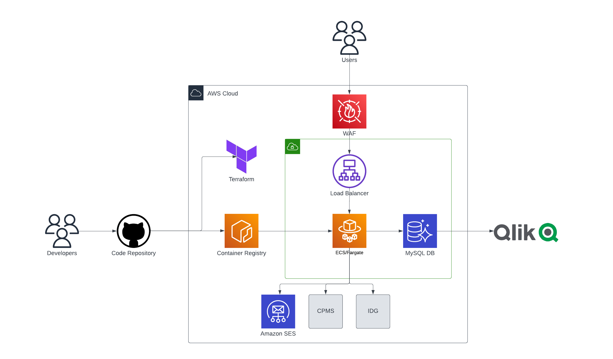

# sponsor-engagement-infrastructure
**Description**: Terraform code for sponsor-engagement-Infrastructure

This is the main Repo for the sponsor-engagement infrastucture code.

The backend code lives over in https://github.com/PA-NIHR-CRN/sponsor-engagement-web

**Architecture**



**Resources**
* Amazon ECS (Fargate)
* Amazon ECR
* AWS WAF
* AWS Application/Network Load Balancer
* AWS Aurora
* AWS CloudWatch

**Structure of Code**: 

```bash
.
├── README.md
├── cred
│   └── cred.tf
├── global.tf
├── main.tf
├── modules
│   ├── cloudwatch_alarms
│   │   ├── alb-alarms.tf
│   │   ├── ecs-error-alarms.tf
│   │   ├── rds.tf
│   │   └── var.tf
│   ├── aurora-db
│   │   ├── db.tf
│   │   └── var.tf
│   ├── container-service
│   │   ├── acm.tf
│   │   ├── iam_role.tf
│   │   ├── lb.tf
│   │   ├── main.tf
│   │   └── var.tf
│   ├── event_role
│   │   ├── iam.tf
│   │   └── var.tf
│   ├── ecs_scheduled_task
│   │   ├── task.tf
│   │   └── var.tf
│   ├── ecr
│   │   ├── main.tf
│   │   └── var.tf
│   ├── waf
│   │   ├── waf.tf
│       └── var.tf
├── output.tf
└── versions.tf
```

---


## GitHub Actions

A handful of GitHub Actions workflows are defined. These are described below:

* deploy-all-env.yml - on merge to 'main' branch this workflow will deploy the Terraform code for dev/test/uat/oat/prod in that order and will display the Terraform Plan of each environment and requires an approval to deploy at each stage
* deploy-env.yml - Manual terraform plan of any environment.
* pr.yml - Automatic workflow that runs terraform plan on the dev environment after any push to a 'feature' branch or creation of a pull request.


## Deployment process

To deploy new changes to the sponsor-engagement infrastructure follow these steps:

 * Create a feature branch off of the 'main' branch.
 * Push changes to feature branch.
 * Push will trigger the 'PR - Terraform Plan Dev' workflow to run a terraform plan in the dev environment.
 * Create a pull request to 'main' branch and 1 review is required to merge, with the terraform plan available for the reviewer to quality check.
 * After approval merge to main and the 'CD - Deploy to all Environments' will run starting with Dev that will automatically deploy.
 * After dev is deployed each environment will run a terraform plan that requires manual approval to deploy in stages.
 * If theres any errors or further changes another feature branch can be created to start the process again

#### Deployments to production requires CAB approval for any changes impacting live infrastructure ####